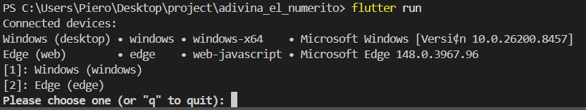

# adivina_el_numerito

A new Flutter project.

## Getting Started

# Día 1:  CREANDO APP FLUTTER + EMULADOR ANDROID STUDIO
Mediante los comandos de ">create flutter adivinar_numerito" creo la app. 

Me genera un problema, no hay un emulador de dispotivo para visualizar la app, con el comando "Flutter run" me lanza solo a acudir a los navegadores disponibles (en mi caso Microsoft Edge) 

 

Por lo que tengo que descargar Android studio para crear un emulador de android. 
Para esto, entro en Android Studio, me voy a **tools>device manager >añadir dispositivo móvil (pixel 7 Pro)**. 

Escogí una API que tenga más usos , en este caso la API 35. 

 

Una vez echo eso, proseguí a ejecutar nuevamente `Flutter run` y empezó a descargar herramientas, luego empezó a ejecutar el Gradle, luego va compilando (El APK se va ejecutando) y se va instalando. 

 

Con esto estaría todo preparado. 

# Día 2: LÓGICA DEL NÚMERO ALEATORIO 

Haremos uso primero de dos widgets, el `StatelessWidget` y `StatefulWidget`.
- StatelessWidget: Es un widget "sin memoria". Una vez que se dibuja, no cambia.    
- StatefulWidget: Es un widget "con memoria". Este sí puede redibujarse cuando su estado cambia.

Empezaremos a usar estados (state), ya que es la memoria de nuestra app. Guarda datos que pueden cambiar.

Planteo un razonamiento para ver como sería la generación de número aleatorios en Flutter:
`
Usuario abre la app  ->  
Flutter ejecuta initState() ->  
Se crea un objeto Random() -> 
Random decide un número (ej: 47) ->
Se guarda en la variable numeroSecreto -> 
Flutter redibuja la pantalla con ese número  
`
Una vez planteado, creamos variables y clases para definir con más precisión:

`
1. main() llama a runApp()
2. Flutter crea MyApp
3. Flutter ve "home: NumeroScreen()"
4. Se crea NumeroScreen (StatefulWidget)
5. Se crea _NumeroScreenState (el estado)
6. Se ejecuta initState() por primera vez.
7. Dentro de initState, se llama a _generarNumero()
8. _generarNumero() crea Random() y genera un número.
9. Se guarda en numeroSecreto
10. setState() le dice a Flutter: "Redibuja!!" 
11. Se ejecuta build() y muestra la pantalla.
`

